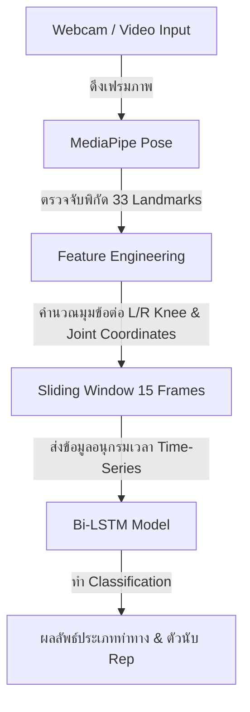

# 🎓 คลังข้อมูลและแนวทางการตอบคำถามอาจารย์ (QA Guide & Project Evidence)
**โปรเจกต์: ระบบวิเคราะห์ท่าออกกำลังกายด้วย MediaPipe + Bi-LSTM**

เอกสารฉบับนี้ถูกบันทึกไว้ที่โฟลเดอร์ `reports/` เพื่อใช้เป็นข้อมูลอ้างอิงและหลักฐานเชิงทฤษฎีในการตอบคำถามอาจารย์ ผู้ตรวจประเมิน หรือคณะกรรมการสอบโครงงาน

---

## 📌 ส่วนที่ 1: สรุปสถาปัตยกรรมและเทคโนโลยีที่ใช้ (Architecture Overview)

หากอาจารย์ถามว่า **"ระบบนี้ทำงานอย่างไร? มีขั้นตอน (Pipeline) อย่างไร?"** ให้ตอบตามภาพรวมนี้:

### 1. ทำไมต้องใช้ MediaPipe Pose?
* **คำตอบ**: เพราะ MediaPipe Pose เป็นเทคโนโลยีตรวจจับจุดพิกัดร่างกาย (Pose Landmarking) แบบรวดเร็วและใช้ทรัพยากรเครื่องต่ำมาก มันจะส่งพิกัดตำแหน่ง $x, y, z$ และค่าความน่าเชื่อถือ (Visibility) ของจุดข้อต่อหลัก 33 จุดบนร่างกาย โดยไม่ต้องรันโมเดล Deep Learning ขนาดใหญ่บน GPU ช่วยให้ระบบทำงานแบบ Real-time บนคอมพิวเตอร์ทั่วไปได้

### 2. ทำไมต้องใช้ Bi-LSTM (Bidirectional Long Short-Term Memory)?
* **คำตอบ**: การเคลื่อนไหวของมนุษย์ในการออกกำลังกายเป็น **ข้อมูลอนุกรมเวลา (Time-Series)** ที่ท่าทางในเฟรมถัดไปขึ้นอยู่กับเฟรมก่อนหน้า 
* โมเดล **LSTM แบบทิศทางเดียว (Unidirectional)** จะประมวลผลข้อมูลจากอดีตมาถึงปัจจุบันเท่านั้น แต่ **Bi-LSTM** จะเรียนรู้ข้อมูลทั้งจากอดีตไปสู่อนาคต และอนาคตย้อนกลับมาหาอดีต (Forward & Backward passes) ทำให้เข้าใจ "บริบทของการเคลื่อนไหวครบวงรอบ" ได้ดีกว่ามาก เช่น การแยกแยะจุดสูงสุด (Peak) ของท่า Squat ตอนย่อตัวลงสุดและกำลังจะยืนขึ้น

### 3. ทำไมต้องแปลงเป็น TFLite (TensorFlow Lite)?
* **คำตอบ**: โมเดล LSTM ทั่วไปเมื่อโหลดบน Python จะประมวลผลได้ช้าและใช้ CPU สูง การแปลงโมเดลเป็น TFLite พร้อมทั้งทำ **Optimization (Quantization)** จะช่วยบีบอัดขนาดของโมเดลให้เล็กลงมาก และช่วยเพิ่มความเร็วในการประมวลผล (Inference Speed) ขึ้นหลายเท่า ทำให้สามารถแสดงผลบนหน้าจอได้ลื่นไหลที่ประมาณ 20+ FPS โดยไม่มีอาการดีเลย์

---

## 📌 ส่วนที่ 2: ความหมายของตัวชี้วัดประสิทธิภาพ (Metrics Interpretation)

หากอาจารย์ชี้ไปที่กราฟในโฟลเดอร์ `reports/` แล้วถามคำถามดังต่อไปนี้:

### 1. กราฟ `training_history.png` บอกอะไรเรา?
* **คำตอบ**: กราฟนี้แสดงการเปลี่ยนแปลงของ **Accuracy (ความถูกต้อง)** และ **Loss (ค่าความสูญเสีย)** ในทุกๆ Epoch ของการเทรน
  * **Train vs Validation**: เส้น Train (สีน้ำเงิน) คือความแม่นยำบนข้อมูลที่ใช้เรียนรู้ เส้น Validation (สีแดง) คือความแม่นยำบนข้อมูลทดสอบที่โมเดลไม่เคยเห็น
  * **การประเมิน**: หากเส้นทั้งสองลู่เข้าหากันที่ค่าระดับสูงแสดงว่าโมเดลเรียนรู้ได้ดี (Good Fit) แต่หากเส้น Train สูงปรี๊ดขณะที่ Validation ต่ำลงหรือสวิง แสดงว่าเกิดปัญหา **Overfitting** (โมเดลท่องจำข้อมูลเทรนมากเกินไป)

### 2. ค่าใน `classification_report.txt` แต่ละตัวแปลความหมายอย่างไร?
* **Precision**: บ่งบอกว่า "เมื่อโมเดลทำนายว่าเป็นท่า Squat มันทำนายถูกจริงกี่เปอร์เซ็นต์" (ป้องกันการแจ้งเตือนผิดพลาด - False Positive)
* **Recall**: บ่งบอกว่า "จากท่า Squat ทั้งหมดที่ผู้ใช้ทำจริงๆ โมเดลสามารถจับภาพและนับเป็น Squat ได้ครบถ้วนกี่เปอร์เซ็นต์" (ป้องกันการตรวจจับตกหล่น - False Negative)
* **F1-Score**: ค่าเฉลี่ย Harmonic Mean ระหว่าง Precision และ Recall เพื่อดูความสมดุล (หาก F1-Score ใกล้ 1.0 หรือ 100% แสดงว่าประสิทธิภาพของโมเดลในท่านั้นสมบูรณ์แบบมาก)
* **Support**: จำนวนตัวอย่างข้อมูล (Frames/Sequences) ของท่านั้นๆ ที่ใช้ในการทดสอบ

### 3. ตาราง `confusion_matrix.png` มีความสำคัญอย่างไร?
* **คำตอบ**: แผนภาพ Confusion Matrix แสดงความสัมพันธ์ระหว่าง **ท่าทางที่เกิดขึ้นจริง (True Label)** และ **ท่าทางที่ AI ทำนาย (Predicted Label)**
  * แถวแนวทแยงมุมจากซ้ายบนลงมาขวาด้านล่าง (Diagonal) คือจำนวนข้อมูลที่ทำนายถูกต้อง
  * ช่องที่อยู่นอกแนวทแยงมุมบ่งบอกว่าโมเดลทายสับสนระหว่างท่าใด เช่น ทายท่า "Squat_Correct" สลับเป็น "Jumping_Jack" หรือ "Idle" ช่วยให้ผู้พัฒนาทราบจุดอ่อนของโมเดลเพื่อเพิ่มข้อมูลในคลาสนั้นๆ ได้ตรงจุด

### 4. กราฟ `roc_curve.png` และค่า AUC บอกอะไรเรา?
* **คำตอบ**: กราฟ ROC (Receiver Operating Characteristic) แสดงขีดความสามารถในการแยกแยะประเภทท่าทางของโมเดล ณ เกณฑ์การตัดสินใจ (Threshold) ต่างๆ โดยพล็อตระหว่างอัตราผลบวกจริง (True Positive Rate) และอัตราผลบวกเท็จ (False Positive Rate)
  * **ค่า AUC (Area Under the Curve)**: คือพื้นที่ใต้เส้นกราฟ ROC มีค่าตั้งแต่ 0.0 ถึง 1.0 ยิ่งค่า AUC เข้าใกล้ 1.0000 แสดงว่าโมเดลนั้นมีประสิทธิภาพสูงในการแยกแยะกิจกรรมนั้นๆ ออกจากกิจกรรมอื่นๆ ได้อย่างเด็ดขาดและแม่นยำที่สุด (ตัวอย่างเช่น ค่า AUC = 0.999x แสดงว่าการทายสลับหรือความสับสนของโมเดลมีโอกาสเกิดขึ้นน้อยมาก)
  * เส้นปะสีดำทะแยงมุม (Random Classifier, AUC = 0.5) คือเกณฑ์อ้างอิงของการทายแบบสุ่ม (เดาสุ่ม)

---

## 📌 ส่วนที่ 3: คำถามยอดฮิตและแนวทางการรับมือ (FAQ for Defence)

### Q1: ข้อมูลที่ใช้เทรน (Dataset) มีลักษณะอย่างไร?
* **แนวทางการตอบ**: ข้อมูลที่นำมาเทรนได้มาจากการบันทึกพิกัดข้อต่อของร่างกายแบบดิบผ่านกล้อง Webcam และวิดีโอตัวอย่างผ่านสคริปต์ `collect_data.py` และ `auto_label_video.py`
* ข้อมูลจะถูกเก็บเป็นไฟล์ CSV ใน `data/landmarks/` แบ่งโฟลเดอร์ตามประเภทกิจกรรม โดยแต่ละแถวใน CSV จะเก็บพิกัดของจุดร่างกาย 33 จุด ($x, y, z$ และ $visibility$) รวมกับคุณลักษณะทางกายวิภาคที่ระบบคำนวณขึ้นมาเพิ่มเติม (Feature Engineering) เช่น มุมของข้อเข่าทั้งซ้ายและขวา (`l_knee_angle`, `r_knee_angle`) จากนั้นนำมาสไลด์เป็นลำดับช่วงเวลา (Sequence) ละ 15 เฟรมต่อเนื่องกัน

### Q2: ในเมื่อความแม่นยำสูงมาก มีการป้องกันการท่องจำข้อมูล (Overfitting) อย่างไร?
* **แนวทางการตอบ**: ในโมเดลสถาปัตยกรรม Bi-LSTM นี้ มีมาตรการป้องกัน Overfitting 3 จุดสำคัญ ได้แก่:
  1. **Dropout Layers (Rate = 0.2)**: ใส่ไว้ระหว่างชั้น LSTM เพื่อสุ่มปิดการทำงานของโหนดในโครงข่ายประสาท 20% ในทุกๆ ขั้นของการเทรน บังคับให้โมเดลหาวิธีเรียนรู้แบบองค์รวมแทนการจำฝังใจ
  2. **Early Stopping Callback**: กำหนดให้คอยตรวจสอบค่า Validation Loss หากมีแนวโน้มหยุดลดลงหรือเริ่มดีดกลับสูงขึ้นเกินกว่า 10 Epoch (Patience = 10) ระบบจะสั่งหยุดเทรนทันทีและดึงน้ำหนักจุดที่ดีที่สุด (Restore Best Weights) มาบันทึกใช้งาน
  3. **Data Splitting**: มีการแบ่งข้อมูลตรวจสอบ (Validation/Test) ออก 20% อย่างเข้มงวดด้วยฟังก์ชัน `train_test_split` ก่อนเริ่มกระบวนการเทรน เพื่อให้แน่ใจว่าโมเดลถูกประเมินกับข้อมูลใหม่เสมอ

### Q3: การนับจำนวนครั้ง (Repetition Counter) ทำงานอย่างไร? ใช้ AI นับหรือไม่?
* **แนวทางการตอบ**: ระบบนี้ทำงานเป็น **Hybrid System (ระบบผสมผสาน)**
  * **AI (Bi-LSTM)**: มีหน้าที่จำแนกประเภทกิจกรรมในแต่ละช่วงเวลา (State Classification) เช่น จำแนกว่าผู้ใช้กำลังทำคลาส `Squat_Correct` หรือยืนเฉยๆ `Idle` แบบ Real-time
  * **Geometry Engine + Rule-Based**: โค้ดในส่วนประมวลผลท่าทาง (เช่น `squat_processor.py`) จะนำผลลัพธ์การจำแนกสถานะจาก AI มาร่วมกับการตรวจสอบมุมข้อต่อ (เช่น มุมงอเข่าต้องผ่านเกณฑ์ต่ำกว่า 100 องศา และต้องยืดตัวกลับขึ้นมาตึงสุดที่สูงกว่า 160 องศา) เพื่อทำการตรวจสอบทิศทางการเคลื่อนไหว และสั่งเพิ่มจำนวนรอบ (Rep Count) เมื่อการเคลื่อนไหวครบวงรอบอย่างถูกต้องจริงเท่านั้น
  * **ข้อดี**: วิธีนี้ช่วยป้องกันการนับรอบมั่วเมื่อผู้ใช้ทำท่าทางไม่ถูกต้องหรือโกงท่าทาง (เนื่องจาก AI จะบล็อกหรือเตือนสถานะความไม่ถูกต้องไว้ก่อน)

---

## 📌 ส่วนที่ 4: สรุปบทบาทของแต่ละไฟล์ในระบบ (File Descriptions)

หากอาจารย์สุ่มชี้ไฟล์แล้วถามว่า **"ไฟล์นี้มีหน้าที่อะไรในระบบ?"** สามารถอธิบายสั้นๆ ได้ดังนี้:

* 🚀 [launcher.py](file:///c:/_Project%20Antigravity/_Project_Exercise/launcher.py): หน้าจอหลัก (Launcher) สำหรับเรียกเปิดทุกเมนูโปรแกรมในระบบอย่างเป็นสัดส่วน
* 🎮 [main_app.py](file:///c:/_Project%20Antigravity/_Project_Exercise/src/main_app.py): สคริปต์แอปพลิเคชันหลักที่แสดงหน้าจอประมวลผลสดบนกล้องเว็บแคม ตรวจจับพิกัด ประเมินผล และนับจำนวน Rep
* 🧠 [train_model.py](file:///c:/_Project%20Antigravity/_Project_Exercise/src/train_model.py): สคริปต์ใช้สำหรับอ่านข้อมูลไฟล์พิกัด สร้าง Sequence เทรนโมเดล Bi-LSTM และประเมินผลสร้างไฟล์วิเคราะห์ประสิทธิภาพในโฟลเดอร์ `reports/`
* 🛠️ [collect_data.py](file:///c:/_Project%20Antigravity/_Project_Exercise/src/collect_data.py): โปรแกรมสำหรับเก็บตัวอย่างข้อมูลพิกัด (Landmarks Dataset) ทั้งทางกล้อง Webcam และจากการอัปโหลดวิดีโอ
* 🤖 [auto_label_video.py](file:///c:/_Project%20Antigravity/_Project_Exercise/src/auto_label_video.py): เครื่องมือช่วยวิเคราะห์วิดีโอออกกำลังกายดิบและสร้างป้ายระบุประเภทท่าทาง (Labeling) แบบอัตโนมัติด้วยหลักการเชิงเรขาคณิต (Geometry)
* ⚙️ [lstm_engine.py](file:///c:/_Project%20Antigravity/_Project_Exercise/src/engines/lstm_engine.py): ตัวประมวลผลสำหรับการรันโมเดล `.tflite` ที่เทรนแล้วเพื่อทำนายกิจกรรม Real-time
* 🗣️ [speech_layer.py](file:///c:/_Project%20Antigravity/_Project_Exercise/src/utils/speech_layer.py): ระบบคอยพากย์เสียงตอบรับและคำเตือนแบบ Asynchronous เพื่อส่งข้อเสนอแนะด้านความถูกต้องให้กับผู้ใช้งานได้โดยไม่มีการหน่วงหน้าจอกล้อง
